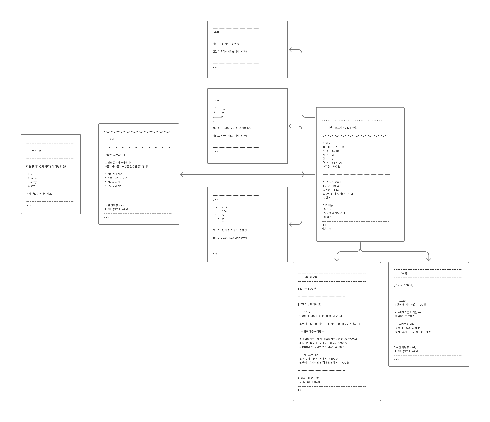

# 씨앗 9기 DB 미니 프로젝트 

## 📅 프로젝트 기간
2025/04/01 ~ 2025/04/04

## 팀원 및 역할
- **정지훈**: 팀장, 퀴즈 API, 프로젝트 설계, ERD 및 DB관리
- **전병윤**: 게임 화면(View), 와이어프레임 디자인
- **최은정**: 퀴즈 데이터, 요구사항 명세서, 활동 API
- **박신형**: 아이템 데이터, 상점 아이템목록 조회, 상점 및 아이템 API

## 📑 목차

1. [개요](#-개요)
2. [사용기술](#-사용-기술)
3. [주요 기능](#-주요-기능)
4. [서비스 화면](#-서비스-화면)
5. [협업](#-협업)
6. [ERD](#️-erd)

  

## 📝 개요

CS 지식을 게이미피케이션을 통해 쉽게 학습할 수 있도록 돕는 프로젝트

  

## 🛠 사용 기술

- **Java 17**
- **JDBC**
- **Oracle DB**

## 🌟 주요 기능

1. **캐릭터 생성 및 캐릭터의 상태관리**
2. **CS 지식 퀴즈**
3. **게임 화면 출력**

  

## 🖥️ 서비스 화면

<table width="100%" border-style="non" cellspacing="0" cellpadding="100">
  <tr>
    <td align="center"></td>
    <td align="center"></td>
    <td align="center"></td>
  </tr>
  <tr>
    <td align="center"></td>
    <td align="center"></td>
    <td align="center"></td>
  </tr>
</table>

    

## 🤝 협업

### 🔧 GIT

Git Flow에 기반하되 간략화한 방식으로 Branch 관리
- **Main → Develop → Feature**
- **커밋 컨벤션**:  
   `feat`: 기능 개발  
   `refactor`: 코드 리팩토링  
   `fix`: 버그 수정   
   `docs`: 문서 작업   

### 🎨 Figma

스토리보드 작성 및 화면 설계

--- 
### 📋 스프레드시트
요구사항 문서화 및 데이터 정리

  

## 🛢️ ERD

